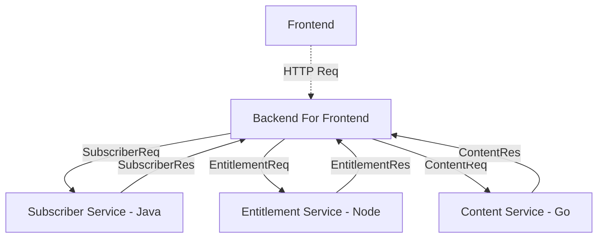

# MameViewer

<b>M</b>ost <b>A</b>wesome <b>M</b>ovies <b>E</b>ver Viewer

gRPC + protobuf demo written in Java, NodeJS and Go

---

# Tech Stack

| <b>Tech</b>   | <b>Purpose</b>              |
|---------------|-----------------------------|
| Protobuf:     | Data format                 |
| gRPC:         | Inter-service communication |
| Java/Node/Go: | Backend Microservices       |
| Docker:       | Containerizing              |
| Sonarqube:    | Static Analysis & Reporting |
---

# Protocol Buffers

What is Protobuf?

<v-clicks>

Language-neutral, platform-neutral

Mechanism for De/serializing structured data

Similar to XML or JSON but smaller, faster, and lighter

Forwards and backwards compatible

Composed of `messages` and `services` declared in `.proto` files

Compiled using protocol compiler (protoc)

</v-clicks>

---
layout: two-cols
---

# Messages
Sample Proto File
```protobuf{all|none}
message Person {
  string name = 1; // Unique field number
  int32 id = 2;  // Built in types
  optional string email = 3; // Not required
}

service PersonService {
  rpc SavePerson(Person) returns (Person);
  rpc GetPerson(Person) returns (Person);
  rpc DeletePerson(Person) returns (Person);
}
```

:: right ::

Message Definition

```protobuf {none|1|2|3|4|all}
message Person {
  string name = 1; // Unique field number
  int32 id = 2;  // Built in types
  optional string email = 3; // Not required
}
```


<v-click>

Building a message in Java - POJO!

```java{none|1|2|3|4|5|6|7|all}
Person med = Person.newBuilder()
    .setId(1234)
    .setName("Med Oz")
    .setEmail("med@oz.com")
    .build();
output = new FileOutputStream(args[0]);
med.writeTo(output);
```

</v-click>

[//]: # (<v-click>)

[//]: # (Above message represented in Hex:)

[//]: # ()
[//]: # (```shell)

[//]: # (0A 06 4D 65 64 20 4F 7A 10 D2 09 1A 0A 6D 65 64 40 6F 7A 2E 63 6F 6D)

[//]: # (```)

[//]: # (</v-click>)

<style>
.slidev-code-wrapper {
  margin-right: 16px !important;
}
</style>

---
layout: two-cols
---

# Messages

Encoding

JSON Representation

```json
{
    "userName": "Martin",
    "favoriteNumber": 1337,
    "interests": ["daydreaming", "hacking"]
}
```

<v-click>

Protobuf Message

```protobuf
message Person {
  string userName = 1;
  optional int64 favoriteNumber = 2;
  repeated string interests = 3;
}
```

</v-click>

:: right ::

<v-clicks>

Encoding Details


Each field starts with a byte indicating tag number

Field names are not encoded, can be changed

Optional fields not encoded if not present

Field numbers MUST NOT CHANGE

Source: [Martin Kleppmann](https://martin.kleppmann.com/2012/12/05/schema-evolution-in-avro-protocol-buffers-thrift.html)

</v-clicks>

<style>
.slidev-code-wrapper {
  margin-right: 16px !important;
}
</style>

---

# Services

Protocol Buffers

<v-clicks>

Used with an RPC (Remote Procedure Call)

Protoc plugins to generate language specific service stubs

gRPC (Google official) is the commonly used RPC framework

```protobuf {none|1|2|3|4|all}
service PersonService {
  rpc SavePerson(PersonCreateRequest) returns (PersonCreateResponse);
  rpc GetPerson(PersonGetRequest) returns (PersonGetResponse);
  rpc DeletePerson(PersonDeleteRequest) returns (PersonDeleteResponse);
}
```
</v-clicks>

---
layout: two-cols
---

# gRPC

1.50: 'g' stands for 'galley'

<v-clicks>

Open source

High performance

Easy to implement services

Unary calls

Client streaming 

Server streaming

Bidirectional streaming

Flexible Metadata (headers)

Cancelable

</v-clicks>

::right::


<v-click>


</v-click>

---

# Service Stub

gRPC

Given the following service definition

```protobuf
service PersonService {
  rpc SavePerson(PersonCreateRequest) returns (PersonCreateResponse);
}
```

<v-click>

protoc (Java) will generate `PersonServiceGrpc` which can be overridden:

```java{none|1-3|4-6|7-8|9-11|all}
public class PersonService extends PersonServiceGrpc.PersonServiceImplBase {
  @Override
  public void savePerson(PersonCreateRequest request, StreamObserver<PersonCreateResponse> responseObserver) {
    if(isPersonValid(request)) {
      boolean success = savePersonToPersistentStorage(request);
      PersonCreateResponse response = PersonCreateResponse.newBuilder().setSuccess(success).build();
      responseObserver.onNext(response);
      responseObserver.onCompleted();
    } else {
      responseObserver.onError(INVALID_ARGUMENT.withDescription("A name is required").asRuntimeException());
    }
  }
}
```

</v-click>

---

# MameViewer Implementation


<div style="text-align: center">

</div>

---
layout: center
class: text-center
---

# Learn More

[Protobuf](https://developers.google.com/protocol-buffers) ·
[gRPC Guides](https://grpc.io/) · 
[SonarQube Intro](https://www.bitslovers.com/how-to-use-sonarqube-with-docker-and-maven/)
